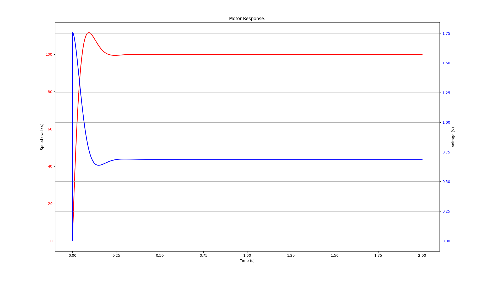

# pymil
Demonstrates how python can be used to model &amp; prototype system control ideas.

In this case, a simple DC motor model as a first order transfer function (low pass filter). Models can be as complex as allowed by the python language and modeling libraries. The embedded C code is compiled as a shared library and loaded on runtime. This allows you to quickly discover bugs in your code without the need for hardware.

The code designed to run on an embedded target is pid.c, pid.h files. The following picture are the simulation results of a simple DC motor model controlled by a PI controller written in pure C:

